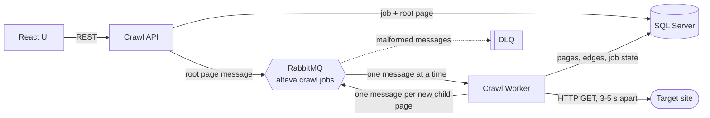

# Home Assignment - Alteva - Web Crawler System

## Overview
This is a home assignment for a job-based, event-driven web crawler. A user submits a URL; the crawl runs asynchronously through RabbitMQ — **one message per page, recursively, up to the requested depth** — and the React UI shows progress and, once complete, a tree of discovered pages with each page's **Domain Link Ratio**.

**Stack:** .NET 8 (ASP.NET Core API + worker) · React 19 + Vite · RabbitMQ · SQL Server (EF Core) · Docker Compose

Detailed design notes, diagrams and verification results: [`dev_content/architecture_notes.md`](dev_content/architecture_notes.md).

---

## Run Locally

### Prerequisites
- [Docker & Docker Compose](https://docs.docker.com/get-docker/)
- [Node.js 18+ & npm](https://nodejs.org/) for the frontend

### 1. Configure
```bash
cp .env.example .env
```
Replace the `REPLACE_WITH_...` placeholders in `.env` (SQL Server requires a strong password).

### 2. Start the backend (SQL Server, RabbitMQ, API, worker)
```bash
docker compose up --build -d
```
The API applies EF Core migrations on startup.

### 3. Start the frontend
```bash
cd frontend
npm install
npm run dev
```

| What | URL |
| :--- | :--- |
| UI | http://localhost:5173 |
| API (Swagger in Development) | http://localhost:8080/swagger |
| API health | http://localhost:8080/health |
| Worker health (RabbitMQ consumer + database) | http://localhost:8081/health |
| RabbitMQ management | http://localhost:15672 |

### Run the tests
```bash
dotnet test Alteva.slnx
```
```bash
cd frontend && npm test
```
108 .NET tests (domain, infrastructure, worker, API) and 9 frontend tests. CI (`.github/workflows/ci.yml`) runs both on pull requests to `main`.

---

## Architecture



| Project | Responsibility |
| :--- | :--- |
| `Alteva.Domain` | Pure logic: URL normalization, link extraction, Domain Link Ratio, tree building, entities, message contract |
| `Alteva.Infrastructure` | EF Core `AppDbContext` + migrations, `CrawlStateStore` (all crawl-state transactions), RabbitMQ publisher (publisher confirms) and topology |
| `Alteva.CrawlApi` | Create / cancel / delete jobs, job details with progress and tree, paginated history, `/health` |
| `Alteva.CrawlWorker` | Consumes page messages: download → parse → persist → publish children; `/health` |
| `frontend` | Start Crawl, Job Details (progress bar, tree), History |

### Key choices
1. **Recursion over the queue.** Each message is one page. The API publishes the root (depth 0); the worker crawls a page, claims its unseen same-domain links and publishes one message per link at `depth + 1` until `maxDepth`. State lives in SQL Server, not in worker memory, so a crash loses nothing.
2. **One worker, one message at a time, no parallelism** (prefetch 1). Deliberately simple: the FIFO queue then yields a breadth-first crawl, so each page is first reached at its shortest depth, and there are no races between workers.
3. **Politeness first.** A random 3–5 s delay precedes every download (retries included), so the crawler stays well under typical rate limits. The cost is throughput: a 200-page crawl takes ~15 minutes.
4. **Database as the source of truth for de-duplication.** A page is *claimed* by inserting it as `Queued`; a unique key on `(JobId, UrlHash)` makes each URL claimable once per job.
5. **Never lose a message, never strand a job.** Publisher confirms before acking, explicit acks only after the page is committed, and infrastructure failures are retried rather than dead-lettered.

---

## API

| Method & path | Description |
| :--- | :--- |
| `POST /api/jobs` | Body `{ "url": string, "maxDepth"?: number (1–10, default 2) }` → `202 { "jobId" }`. `400` for invalid URLs; `503` (job marked `Failed`) if the message broker is unavailable. |
| `GET /api/jobs/{id}` | Status, timestamps, failure reason, `pagesDiscovered` / `pagesProcessed`; `tree` once `Completed`. |
| `GET /api/jobs?page=1&pageSize=20` | History, most recent first. |
| `POST /api/jobs/{id}/cancel` | Cancel a `Pending`/`Running` job. |
| `DELETE /api/jobs/{id}` | Delete a finished job with its pages and edges. |

Job status: `Pending | Running | Completed | Failed | Canceled` (serialized as strings).

---

## Crawling Rules

- **HTML only.** Non-HTML responses are recorded as `Skipped`.
- **Depth:** default 2, maximum 10. **Same domain only:** links on the starting host or its subdomains are crawled; all links are stored as edges.
- **Max pages per job:** `MAX_PAGES_SAFETY_LIMIT` (default 200); further links are kept as edges only.
- **Normalization:** relative links resolve against the URL the page was actually served from (after redirects); fragments stripped; scheme and host lower-cased; default ports removed; trailing slash removed; percent-encoding preserved; href HTML entities decoded. `mailto:`, `tel:`, `javascript:`, `data:` and other non-http(s) links are ignored.
- **Duplicates:** the same normalized URL is never processed twice within a job (URLs are compared case-sensitively).
- **HTTP:** 15 s timeout per attempt, retries for transient failures (see below).

### Domain Link Ratio
```
Domain Link Ratio = (# outgoing links within the starting domain) / (total # outgoing links)
```
The starting domain is the host of the job's URL (subdomains count as internal). Ignored schemes are excluded from both counts. A page with no outgoing links has ratio 0. Pages that were not crawled (`Failed`, `Skipped`) have no ratio.

---

## Message Schema

Exchange `alteva.crawl.exchange` (direct) → queue `alteva.crawl.jobs` (durable, persistent messages).

```json
{
  "jobId": "3fa85f64-5717-4562-b3fc-2c963f66afa6",
  "url": "https://example.com/docs",
  "depth": 1,
  "maxDepth": 2,
  "rootUrl": "https://example.com/"
}
```
`url` is normalized and equals the stored page URL; `maxDepth` and `rootUrl` are copied from the job so the worker never reloads it.

## Idempotency Strategy

Delivery is at-least-once; processing the same message twice has no additional effect.
- **Pages:** unique index on `(JobId, UrlHash)`, where `UrlHash` is the SHA-256 of the normalized URL (it keeps the index key within SQL Server's 1700-byte limit and compares URLs case-sensitively). A page is claimed by inserting it as `Queued`.
- **Page gate:** before any work, the worker checks the page is still `Queued` and the job still active; otherwise the message is acked and dropped.
- **One transaction per page:** the page result, its edges (de-duplicated in memory), newly claimed children and the job's final status commit together, guarded by `WHERE Status IN ('Pending','Running')`. A finished page is never committed again, so edges need no unique index.
- **Crash between commit and publish:** the redelivered message finds the page finished and re-publishes its children that are still `Queued`; duplicate child messages are dropped by the gate.

## Retry Policy

| Failure | Transient? | Handling |
| :--- | :--- | :--- |
| Network error, HTTP timeout, HTTP **408, 429, 5xx** | Yes | Retried in-process, up to **3 attempts** per page. Each attempt waits the politeness delay, or `Retry-After` if longer (max 30 s). Then the page is `Failed`. |
| Other HTTP **4xx** (403, 404, …) | No | Page `Failed` immediately. |
| Unexpected processing error (e.g. database error) | Yes | Message requeued after 10 s; on a second failure the page is marked `Failed`. |
| Database or broker unavailable so the page cannot even be marked `Failed` | Yes | Requeued every 10 s until the infrastructure recovers, then processed normally. |

A failed **root** page fails the job. Worker shutdown mid-page requeues the message.

## Dead-Letter Queue

`alteva.crawl.dlx` → `alteva.crawl.jobs.dlq`. **Only malformed messages** go there: invalid JSON, missing fields, `depth` outside `0..maxDepth`, or an unknown contract. Everything else is retried or recorded as a failed page, because a dead-lettered page would leave its job running forever. Inspect it in the RabbitMQ management UI.

## Cancellation

RabbitMQ cannot delete individual messages, so cancellation guarantees a cancelled job's messages are **never processed**: the API marks the job `Canceled` and its queued pages `Skipped` in one transaction; remaining messages are dropped instantly (no delay, no download); the page in progress is aborted within ~1 s (the worker polls job status during delays and downloads); and the commit guard discards anything that finishes after the cancel.

## Observability

- Structured logs with `JobId` and URL on every crawl event; EF Core SQL and HttpClient noise filtered to warnings.
- Health endpoints for both services (see [Run Locally](#run-locally)); the worker's reports RabbitMQ consumer and database state, bounded to ~3 s.

## Configuration

| Variable | Default | Purpose |
| :--- | :--- | :--- |
| `MAX_PAGES_SAFETY_LIMIT` | 200 | Max pages per job |
| `CRAWLER_DELAY_MIN_SECONDS` / `CRAWLER_DELAY_MAX_SECONDS` | 3 / 5 | Random delay before each download attempt |
| `API_PORT` / `WORKER_HEALTH_PORT` | 8080 / 8081 | Host ports |
| `SQL_SERVER_*`, `RABBITMQ_*` | see `.env.example` | Infrastructure connection settings |

Secrets come only from `.env` (git-ignored); `.env.example` holds placeholders.

---

## Known Limitations

- **Throughput:** one worker, one page every few seconds. Running more workers would break the ordering and race-free assumptions the design relies on.
- **Head-of-line blocking:** a persistent infrastructure failure blocks the single worker (retrying every 10 s) until fixed; `/health` reports it.
- **No SSRF protection:** any http(s) URL is crawled, including private and internal addresses. Do not expose the API publicly.
- **Link handling:** HTML is parsed with a regular expression; `<base href>` is ignored; redirects are followed to other hosts and the page is stored under the requested URL; `robots.txt` is not consulted.
- **Tree only for completed jobs;** cancelled or failed jobs show progress but no tree.
- **No authentication;** CORS allows any origin.
- **No container healthchecks:** the ASP.NET runtime image has no `curl`/`wget`, so Compose does not probe `/health`.
- **Deployment:** the page message contract replaced an older job-level one; drain the queue before upgrading an existing deployment.

---

## Implementation Notes

### What I implemented first, and why
1. **The crawl core and its correctness:** URL normalization, link ratio, duplicate handling and depth limits, with unit tests. Correctness carries the most weight and everything else depends on it.
2. **Event-driven robustness:** the recursive one-page-per-message design with database-backed claims, publisher confirms, explicit acks, the page gate and redelivery handling, so that at-least-once delivery, crashes and outages never duplicate pages or strand jobs.
3. **Cancellation and failure policy** (HTTP retries, infrastructure retries, DLQ only for poison), then **progress, the tree view and health endpoints**.
4. **Verification against real infrastructure:** smoke and outage tests on Docker Compose against a local fixture site (worker killed mid-page, broker restarted, SQL Server stopped mid-crawl).

### What I cut, and why
- **Parallel crawling / multiple workers:** a single sequential consumer removes a whole class of race conditions and makes breadth-first order free. Politeness mattered more than speed.
- **Transactional outbox:** publisher confirms plus "mark the job `Failed` if the root cannot be published" and "re-publish queued children on redelivery" cover the same failure modes more simply.
- **SSE/SignalR progress:** polling every 3 s is sufficient.
- **robots.txt, SSRF guard, a real HTML parser:** valuable, but not required for the core flow; listed under limitations.

### What I would do next
1. **SSRF protection:** resolve hosts and block private, loopback and link-local ranges, re-checking after redirects.
2. **robots.txt and `Crawl-delay`;** stop following redirects to other hosts; honour `<base href>`; use a real HTML parser (e.g. AngleSharp).
3. **Integration tests on real infrastructure** (Testcontainers for SQL Server and RabbitMQ), plus the smoke scenarios as an automated CI job.
4. **Scale-out:** multiple workers with per-domain rate limiting and a partial tree for cancelled jobs.

---

## Development Effort (AI-Assisted)

The project was built in two stages:

| Stage | Tool | Time | Tokens |
| :--- | :--- | :--- | :--- |
| Preliminary setup (the original version of the project, before the refactor) | Antigravity | About 1 hour 10 minutes | About 700,000 |
| Recursive page crawl refactor (PR #9): code review through final end-to-end run | Claude Code (Claude Opus 5) | About 2 hours 5 minutes | About 75M read / 297K written (≈10.2M effective, see below) |
| **Total** | | **About 3 hours 15 minutes** | |

The two token figures are not directly comparable, since each tool counts usage differently (the Claude Code numbers include every re-read of the conversation), so they are listed separately rather than added up. The rest of this section covers the Claude Code refactor session.

### Time
- **About 2 hours 5 minutes** of wall-clock time (20:06–22:11, 2026-09-15), including waiting for Docker builds, test runs and the ~10-minute end-to-end suite.
- First commit of the refactor at 20:38, final merge at 22:08.

### Tokens
- **About 215 model requests.**
- **About 75 million tokens read**, almost all of it (74.5M) the same conversation re-read from cache on each step, and **about 297,000 tokens written**.
- **About 10.2 million effective tokens**, weighting re-read (cached) tokens at 0.1×, newly cached tokens at 2× and written output at 5× the cost of a regular input token.
- One helper agent ran (the design review, "assumption hunter"), using about 0.24M effective tokens.

### Where the tokens went (approximate)

| Group | Effective tokens | Share |
| :--- | ---: | ---: |
| Reading & editing files | 3.76M | 37% |
| Conversation & Claude's writing (plans, reviews, reasoning, summaries) | 3.15M | 31% |
| Running commands & tests (builds, test runs, Docker, smoke/end-to-end scripts) | 1.42M | 14% |
| Claude's standing instructions (built-in rules and tool list) | 1.35M | 13% |
| Helper agent (design review) | 0.24M | 2% |
| Other (reminders, questions) | 0.23M | 2% |
| In-app browser (diagram checks) | 0.07M | <1% |
| **Total** | **≈10.2M** | |

- **Reading and editing files was the largest share.** Every file opened or changed stayed in the conversation and was re-read on every later step; several large files (the worker, the tests) were read many times.
- **Talking and writing came second:** plans, reviews, explanations and summaries, plus reasoning. Written output is the most expensive kind of token.
- **Running commands and tests** covers builds, test runs, Docker checks and the smoke and end-to-end scripts, whose output also stayed in the conversation.
- **Standing instructions** are re-read on every step, which adds up over a long session.
- **The biggest cost driver was length:** one long conversation meant everything done early was re-read on every later step. Starting fresh conversations for separate phases would have been cheaper.
