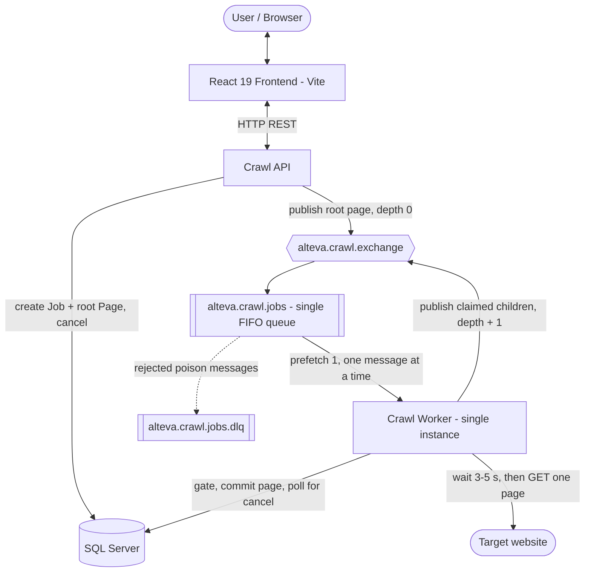
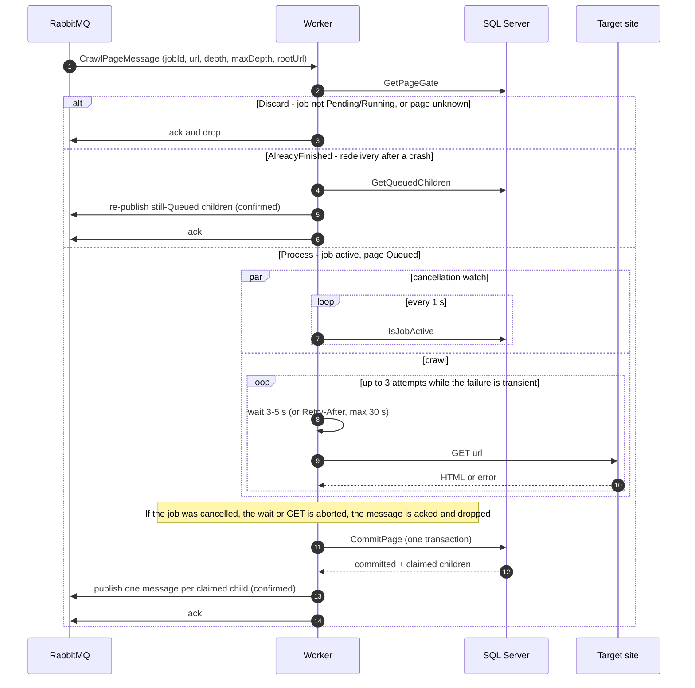
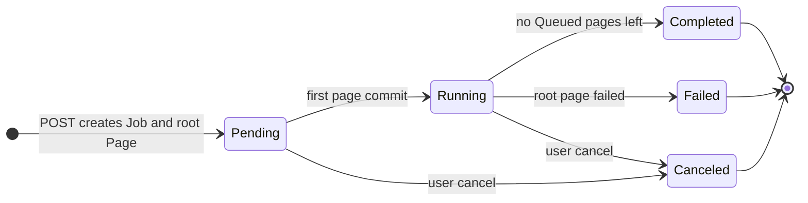
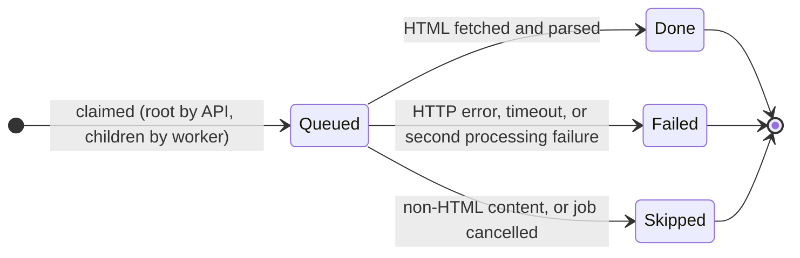
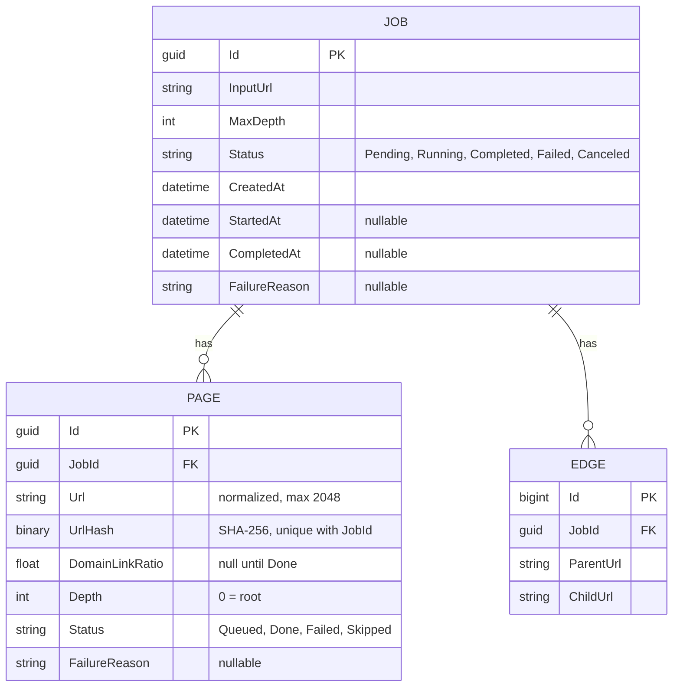

# Alteva Architecture & Engineering Notes

- **Project:** Alteva Web Crawler System
- **Tracking Directory:** `dev_content/`
- **Last Updated:** 2026-09-15
- **Status:** Describes the **recursive page crawl** being built on `feat/recursive-page-crawl`. See [§8 Implementation Status](#8-implementation-status) for what is already in code.

---

## 1. System Architecture Overview

An asynchronous, event-driven system: a REST API, a single background crawl worker, RabbitMQ, SQL Server, and a React frontend.

The crawl is **recursive over the message queue**: every message is **one page**. The API publishes the root page; the worker crawls a page, claims its unseen same-domain links, and publishes one message per claimed link at `depth + 1` until the job's `MaxDepth` is reached.



---

## 2. Component Boundaries & Responsibilities

| Component | Responsibility | Boundary / Invariants |
| :--- | :--- | :--- |
| **`Alteva.Domain`** | Pure domain logic and models | No infrastructure dependencies. URL normalization, `UrlHasher`, Domain Link Ratio, HTML link extraction, tree construction, `CrawlPageMessage` contract. |
| **`Alteva.Infrastructure`** | Data access & messaging | `AppDbContext` + migrations; `ICrawlStateStore` (all crawl-state reads/writes); `RabbitMQMessagePublisher` (publisher confirms); `RabbitMQTopology` (single topology definition). |
| **`Alteva.CrawlApi`** | Orchestrator & UI gateway | Validates requests, creates a `Pending` job with its `Queued` root page, publishes the root message, cancels/deletes jobs, serves status and tree views. Applies EF migrations on startup. |
| **`Alteva.CrawlWorker`** | Background crawler (exactly **one** instance) | Consumes one page message at a time: gate → polite download with HTTP retries → commit → publish children → ack. Serves `/health` (RabbitMQ consumer + database). |
| **`frontend`** | User interface | Submits crawl requests, polls status, renders the page tree and job history. |

---

## 3. Recursive Page Crawl

### 3.1 Invariants
1. **One worker, prefetch 1, no parallelism.** The worker handles one message end to end before RabbitMQ delivers the next. `docker-compose.yml` enforces a single worker via `container_name`.
2. **Breadth-first by construction.** The queue is FIFO and a requeued message keeps its position, so all depth-*d* pages of a job are processed before any depth-*d+1* page. A page is therefore always first claimed at its **shortest depth** — no depth-lowering logic exists.
3. **A page is claimed by inserting `Page(Queued)`.** The unique index `(JobId, UrlHash)` makes a URL claimable once per job. A message is published only for a page the worker has just claimed (or re-published on redelivery, see 3.4).
4. **Same domain only.** Children are claimed only when they are on the starting host or its subdomains. All links, internal or external, are stored as edges and count toward the ratio.
5. **Politeness.** A random delay between `CRAWLER_DELAY_MIN_SECONDS` and `CRAWLER_DELAY_MAX_SECONDS` (default 3–5 s) precedes every download attempt, retries included.
6. **Page limit.** A job never has more than `MAX_PAGES_SAFETY_LIMIT` pages; claims stop at the limit (remaining links are kept as edges only).

### 3.2 Message Contract
- **Exchange:** `alteva.crawl.exchange` (direct) · **Routing key:** `crawl.job.request`
- **Queue:** `alteva.crawl.jobs` (durable, dead-letters to `alteva.crawl.dlx` → `alteva.crawl.jobs.dlq`)
- **Delivery:** persistent messages, publisher confirms, manual acks.

```json
{
  "jobId": "3fa85f64-5717-4562-b3fc-2c963f66afa6",
  "url": "https://example.com/docs",
  "depth": 1,
  "maxDepth": 2,
  "rootUrl": "https://example.com/"
}
```

`url` is the normalized URL and equals `Pages.Url`. `maxDepth` and `rootUrl` (whose host defines "same domain") are copied from the job into every message, so the worker never reloads the job. Invalid messages (missing fields, `depth` outside `0..maxDepth`, or the old job-level contract) are dead-lettered.

### 3.3 Per-Page Flow



**`CommitPage` transaction** (`CrawlStateStore.CommitPageAsync`):
1. **Guard:** `UPDATE Jobs SET Status = 'Running' WHERE Id = @id AND Status IN ('Pending','Running')`. 0 rows → roll back; nothing is written. On SQL Server this also locks the job row until commit, so a concurrent cancel waits.
2. Page must still be `Queued` (otherwise roll back). Set it to `Done` / `Failed` / `Skipped` with ratio and reason.
3. Insert the page's edges (deduplicated in memory, case-sensitive).
4. If the page is `Done` and `depth < maxDepth`: insert unseen same-domain children as `Queued` at `depth + 1`, up to the page limit.
5. **Finish the job:** root page `Failed` → job `Failed`; otherwise, no `Queued` pages left → job `Completed`.

### 3.4 Job & Page Lifecycles





A job is finished when none of its pages are `Queued`. Status transitions of the job happen only inside `CommitPage` (worker) and `CancelJob` (API), both guarded by `WHERE Status IN ('Pending','Running')`.

### 3.5 Idempotency & Redelivery
Delivery is at-least-once. Every step is safe to repeat:
1. **Duplicate or stale message** for a page that is no longer `Queued` → gate returns `AlreadyFinished` (job active) or `Discard` (job finished/cancelled).
2. **Crash between commit and publish** → the redelivered parent message hits `AlreadyFinished` and re-publishes its children that are still `Queued`. A child may be published twice; the second copy is discarded at the gate once the first is processed.
3. **Pages:** unique `(JobId, UrlHash)`. `UrlHash` is SHA-256 of the URL's UTF-16LE bytes — identical to SQL Server `HASHBYTES('SHA2_256', Url)` — which keeps the index key within SQL Server's 1700-byte limit and compares URLs case-sensitively (the `Url` column's collation does not).
4. **Edges:** no unique index. A page's edges are written in the same transaction that finishes the page, and a finished page is never committed again.

### 3.6 Failures, Retry & Dead-Letter
| Situation | Handling |
| :--- | :--- |
| **Transient HTTP failure:** network error, HttpClient timeout (15 s), HTTP 408, 429 or 5xx | Retried in-process, up to **3 attempts** in total. Each attempt waits the politeness delay, or the server's `Retry-After` (capped at 30 s) if longer. Still failing → page `Failed` ("… (after 3 attempts)"). Root → job `Failed`. |
| **Permanent HTTP failure:** any other 4xx (e.g. 403, 404) | Page `Failed` at once, no retry. Root → job `Failed`. |
| Non-HTML response | Page `Skipped`. Root → job `Completed` with a single page. |
| Unexpected exception (e.g. database error), first delivery | Wait **10 s**, then `nack` with `requeue = true` (message keeps its queue position). |
| Unexpected exception on a **redelivered** message (`Redelivered` flag) | Page committed as `Failed` — one retry only, no retry counter. Ack. |
| …and the page cannot be marked `Failed` because the database or broker is unavailable | **Not dead-lettered.** Wait 10 s and requeue, until the infrastructure is back; the page is then crawled normally. (If the job is no longer active, just ack.) |
| Malformed payload (bad JSON, missing fields, old job-level contract) | `nack` with `requeue = false` → dead-letter queue. **The only thing that is dead-lettered.** |

Infrastructure failures are deliberately retried forever rather than dead-lettered: a dead-lettered page would leave its job `Running` with a `Queued` page that nothing will ever process. While the database or broker is down, the single worker waits (10 s between attempts) and `/health` reports `Unhealthy`.
| Worker host shutdown mid-page | `nack` with `requeue = true`; processed again after restart. |

### 3.7 Cancellation
RabbitMQ cannot delete selected messages from a queue, so cancellation guarantees a cancelled job's messages are **never processed**, rather than physically removed:
1. **API cancel** — one transaction: job `Pending`/`Running` → `Canceled`; all its `Queued` pages → `Skipped` (`FailureReason = "Job canceled"`).
2. **Messages still in the queue** are discarded at the gate: no delay, no download, no writes, no children. They drain as fast as the worker reaches them.
3. **The in-flight page is aborted:** during its delay and download the worker polls `IsJobActive` every **1 s** (separate `DbContext` scope). When the job is no longer active it cancels a token linked to the host stopping token, aborting the wait or HTTP request; the message is acked and dropped. Host shutdown must be distinguished from a job cancel (shutdown requeues).
4. **Commit guard:** a cancel landing after the last poll is caught by the transaction guard (3.3 step 1): nothing is persisted and no children are published.
5. Children published in the instant between a commit and a cancel are discarded at the gate.

### 3.8 Publishing & Topology
- `RabbitMQMessagePublisher.PublishAsync` returns only after the broker **confirms** the message and throws otherwise (5 s timeout). The worker acks a page only after all its children are confirmed.
- The publisher has no automatic recovery: a closed channel is reopened on the next publish, so no confirm state is lost across reconnects. The worker's consumer connection uses automatic recovery.
- Topology is declared by both publisher and worker through `RabbitMQTopology.Declare`, so declarations cannot drift. The publisher declaring it means a root message is routed even before the worker has started.

### 3.9 API: Create, Cancel, Progress & Tree
- **Create** (`POST /api/jobs`): `CrawlStateStore.CreateJobAsync`, then publish the root message. If the publish fails (no broker confirm), the job is marked `Failed` via `FailJobAsync` ("The crawl could not be queued") and the API returns **503** — a job is never left `Pending` without a message.
- **Cancel** (`POST /api/jobs/{id}/cancel`): 404 if unknown, otherwise `CancelJobAsync` (atomic, §3.7); 400 if the job is already terminal.
- **Progress** (`GET /api/jobs/{id}`): `pagesDiscovered` (all pages of the job) and `pagesProcessed` (pages no longer `Queued`), from one grouped count.
- **Tree** (only once `Completed`): a breadth-first spanning tree. Each page appears **exactly once**, under the first page — in breadth-first order over edges in insertion order — that links to it, which mirrors how the crawl claimed it. Only pages of the job are nodes (external, beyond-depth and over-limit links are omitted). Nodes carry `status`; `domainLinkRatio` is `null` unless the page is `Done`. Building is linear in pages + edges.
- **JSON:** enums (job and page status) serialize as strings.

---

## 4. Data Model



**Indexes:** `Pages (JobId, UrlHash)` unique · `Pages (JobId, Status)` for the completion check · `Edges (JobId)`. Pages and edges cascade-delete with their job.

---

## 5. Domain Link Ratio Specification

$$\text{Domain Link Ratio} = \frac{\text{\# outgoing links within the starting domain}}{\text{total \# outgoing links}}$$

### Rules & Edge Cases
1. **Starting Domain:** The host of the initial job URL (e.g., `example.com`).
2. **Subdomains:** URLs matching `*.example.com` are counted as internal.
3. **Ignored Schemes:** `mailto:`, `tel:`, `javascript:`, and non-HTTP(S) links are filtered out and excluded from the denominator.
4. **Zero Links:** If a page contains 0 valid outgoing links, the ratio evaluates to `0.0`.
5. **Anchor Fragments:** Anchor hashes (e.g., `/page#section`) are stripped during normalization to avoid duplicate pages.

---

## 6. Configuration

| Setting | Default | Used by | Purpose |
| :--- | :--- | :--- | :--- |
| `MAX_PAGES_SAFETY_LIMIT` | 200 | Worker | Maximum pages per job |
| `CRAWLER_DELAY_MIN_SECONDS` / `CRAWLER_DELAY_MAX_SECONDS` | 3 / 5 | Worker | Random politeness delay before each download |
| HttpClient timeout | 15 s | Worker | Per-download-attempt timeout (code) |
| HTTP attempts | 3 | Worker | Max attempts per page for transient failures; `Retry-After` honoured up to 30 s (code) |
| `WORKER_HEALTH_PORT` | 8081 | Compose | Host port for the worker's `/health` |
| Cancellation poll interval | 1 s | Worker | In-flight page abort (code) |
| Publisher confirm timeout | 5 s | API, Worker | Max wait for broker confirm (code) |
| Failure requeue delay | 10 s | Worker | Wait before requeuing a message after a failure (code) |
| Worker health check timeout | 3 s | Worker | Database check bound, so `/health` answers promptly during an outage (code) |
| `RabbitMQ:*` topology names | `appsettings.json` | API, Worker | Exchange, queue, routing key, dead-letter names |

Secrets and hosts come from `.env` (see `.env.example`); nothing is hard-coded.

---

## 7. Testing Architecture & Verification Strategy

Unit and integration tests run in isolation — no network, no Docker. Persistence tests use SQLite in-memory, so SQL Server specifics (row locks, `HASHBYTES` backfill) and RabbitMQ behaviour (confirms, redelivery) are verified in an end-to-end `docker compose` run.

```
tests/
├── Alteva.Domain.UnitTests/         # 42 tests: UrlNormalizer, UrlHasher, DomainLinkRatio, JobTreeBuilder (each page once, dense sites stay linear)
├── Alteva.Infrastructure.Tests/     # 18 tests: CrawlStateStore flow, cancel & fail, unique indexes, message serialization (SQLite)
├── Alteva.CrawlWorker.Tests/        # 22 tests: recursive crawl over a fake FIFO queue, depth/page limits, politeness delay, HTTP retries (5xx, network error, 429 Retry-After, no retry on 4xx), cancellation (queued, during delay, during download), redelivery, health checks, link extraction
└── Alteva.CrawlApi.Tests/           # 19 tests: request validation, create (incl. 503 on publish failure), progress, tree, cancel
frontend/
└── src/utils/crawlerUtils.test.ts   # 9 tests: Vitest ratio formatting and status badges
```

---

## 8. Implementation Status

| Phase | Scope | Status |
| :--- | :--- | :--- |
| 1 | `CrawlPageMessage`, `PageStatus`, page crawl state, `UrlHash`, migration `AddPageCrawlState` | ✅ Done |
| — | Sequential crawling with politeness delay (no semaphores/parallelism) | ✅ Done |
| 2 | `ICrawlStateStore`, publisher confirms, shared `RabbitMQTopology` | ✅ Done |
| 3 | `PageCrawlHandler` + `PageCrawler` (gate, cancellable delay/download, commit, publish); `Worker` ack/nack incl. one-retry rule and dead-lettering; API creates job with root page and publishes `CrawlPageMessage`; removed `CrawlerEngine`, `RetryTracker`, `CrawlJobRequestedMessage` | ✅ Done |
| — | Smoke test on `docker compose` (see below) | ✅ Done |
| 4 | Cancel via `CrawlStateStore`; 503 + `Failed` job on publish failure; progress counts; breadth-first tree (each page once, page status, no ratio for unfinished pages); string enums in JSON; frontend progress bar and page status in tree; quieter EF/HttpClient logs; `DOTNET_ENVIRONMENT` for the worker | ✅ Done |
| — | HTTP retries for transient failures; worker `/health` (RabbitMQ consumer + database) | ✅ Done |
| 5 | Dropped `Job.RetryCount` (migration `DropJobRetryCount`); infrastructure failures requeue with a 10 s delay instead of dead-lettering; `FailPageOutcome`; worker database health check bounded to 3 s | ✅ Done |
| 6 | Tests, docs, full end-to-end verification | Pending |

**Verified end to end** (`docker compose`, local fixture site): depth-2 crawl with correct depths, ratios, edges and 3–5 s sequential downloads; root 404 → job `Failed`; cancel during a hanging download aborted in ~1 s with 10 queued messages discarded in ~20 ms and pages `Skipped`; malformed and old-contract messages dead-lettered; worker killed mid-page → message redelivered and crawl completed without duplicates; broker down on create → 503 and job `Failed`; broker restart → API publisher reconnects, worker restarts via its restart policy and resumes; transient HTTP errors retried (503×2 → Done, 500×3 → Failed, 429 honours `Retry-After`); SQL Server stopped for ~45 s mid-crawl → the in-flight page is requeued (not failed, not dead-lettered) and the job completes with all pages `Done`, while worker `/health` returns 503 within ~3 s.

**Deployment:** the old and new message contracts are incompatible — drain `alteva.crawl.jobs` before deploying Phase 3.

### Known open issues
- **No Docker healthchecks:** API (`:8080/health`) and worker (`:8081/health`) expose health endpoints, but the ASP.NET runtime image has no `curl`/`wget`, so `docker-compose.yml` defines no container healthchecks for them.
- **Head-of-line blocking on persistent infrastructure failure:** a message whose failure is caused by a lasting infrastructure problem (or a bug that also breaks marking the page `Failed`) is retried every 10 s and blocks the single worker until fixed. Chosen over dead-lettering, which would strand the job.
- **SSRF:** any http(s) URL is crawled, including private/internal addresses.
- **Link handling:** hrefs are not HTML-entity-decoded, `<base href>` is ignored, redirects are followed off-domain, and `Uri.ToString()` unescapes percent-encoding.
