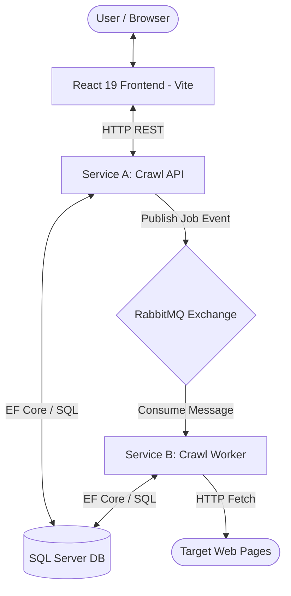

# Alteva Architecture & Engineering Notes

- **Project:** Alteva Web Crawler System
- **Tracking Directory:** `dev_content/`
- **Last Updated:** 2026-09-15

---

## 1. System Architecture Overview

The system is designed as an asynchronous, event-driven microservices architecture composed of two decoupled services, a message broker, a relational database, and a single-page React frontend.



---

## 2. Component Boundaries & Responsibilities

| Component | Responsibility | Boundary / Invariants |
| :--- | :--- | :--- |
| **`Alteva.Domain`** | Pure domain logic and models | Zero external dependencies. Enforces URL normalization (RFC 3986), Domain Link Ratio calculation, and tree construction. |
| **`Alteva.Infrastructure`** | Data access & messaging | Entity Framework Core `AppDbContext`, database migrations, RabbitMQ publisher/consumer implementations. |
| **`Alteva.CrawlApi`** | Orchestrator & UI gateway | Validates client requests, writes initial `Pending` jobs to SQL, publishes crawl events to RabbitMQ, serves status & tree views. |
| **`Alteva.CrawlWorker`** | Background crawler | Consumes crawl tasks, executes BFS crawl traversal, extracts hyperlinks, computes metrics, and persists `Pages` and `Edges`. |
| **`frontend`** | User interface | Submits crawl requests, polls status, renders interactive page hierarchy tree and historical crawl runs. |

---

## 3. Event-Driven Design & Reliability Patterns

### Message Contract
- **Queue Name:** `alteva.crawl.jobs`
- **Exchange:** `alteva.crawl.exchange` (direct)
- **Routing Key:** `crawl.job.request`
- **Dead-Letter Exchange (DLQ):** `alteva.crawl.dlx` -> `alteva.crawl.jobs.dlq`

```json
{
  "jobId": "3fa85f64-5717-4562-b3fc-2c963f66afa6",
  "inputUrl": "https://example.com",
  "maxDepth": 2,
  "submittedAt": "2026-09-15T12:00:00Z"
}
```

### Idempotency Strategy
Under at-least-once message delivery, the same crawl message may be delivered more than once (e.g., consumer crash after processing but before acknowledgment).
To guarantee idempotency:
1. **Pages Idempotency:** The `Pages` table enforces a composite unique constraint on `(JobId, Url)`. Duplicate submissions of the same page in a job are safely ignored/upserted.
2. **Edges Idempotency:** The `Edges` table enforces a composite unique constraint on `(JobId, ParentUrl, ChildUrl)`.
3. **Job State Transitions:** State transitions are guarded (e.g. `Pending` -> `Running` -> `Completed`/`Failed`). Duplicate processing checks if the job is already `Completed`.

### Retry & Dead-Letter Handling
1. **Transient Failures:** Transient network glitches (e.g. temporary DNS failure, connection reset, HTTP 503) are retried with exponential backoff.
2. **Poison Messages:** Malformed messages or permanent errors are rejected (`basic.nack` with `requeue = false`) and routed by RabbitMQ to the Dead-Letter Queue (`alteva.crawl.jobs.dlq`).

---

## 3a. Recursive Page Crawl (Target Design — in progress on `feat/recursive-page-crawl`)

Replaces the one-message-per-job in-memory BFS above. Each message is **one page**.

### Contract
`CrawlPageMessage { jobId, url, depth, maxDepth }` — `url` is normalized and matches `Pages.Url`.

### Invariants
1. **Exactly one worker consumer, prefetch 1, no parallelism.** Messages are processed FIFO, so every depth-*d* page of a job is processed before any depth-*d+1* page: a page is always first claimed at its shortest depth.
2. **A page is claimed by inserting `Page(Queued)`.** The unique index `(JobId, UrlHash)` (SHA-256 of the URL, see `UrlHasher`) makes a URL claimable once per job. A message is published only for a page this worker just claimed.
3. **Page lifecycle:** `Queued` → `Done` | `Failed` | `Skipped`. A job is complete when it has no `Queued` pages.
4. **Politeness:** a random 3–5 s delay (`CRAWLER_DELAY_MIN/MAX_SECONDS`) precedes every download.

### Flow
1. **API `POST`:** insert `Job(Pending)` + root `Page(Queued, depth 0)` in one transaction, then publish.
2. **Worker gate (first step, no delay):** if the job is not `Pending`/`Running`, or the page is not `Queued` → ack and discard.
3. **Delay, then download** — both abortable by cancellation (below).
4. **One transaction:**
   1. `UPDATE Jobs SET Status = 'Running' WHERE Id = @id AND Status IN ('Pending','Running')` — 0 rows → roll back, ack, discard.
   2. Mark the page `Done`/`Failed`/`Skipped`; insert its edges (deduplicated in memory).
   3. If `depth < maxDepth` and the job's page count is under `MAX_PAGES_SAFETY_LIMIT`: insert new same-domain children as `Queued` at `depth + 1`.
   4. If no `Queued` pages remain → job `Completed`.
5. Publish the newly claimed children, then ack.
6. **Redelivery:** a message for an already finished page republishes that page's children still `Queued` (covers a crash between commit and publish). A redelivered message for a `Queued` page (`BasicDeliverEventArgs.Redelivered`) marks the page `Failed` instead of retrying again.

### Cancellation
RabbitMQ cannot delete selected messages from a queue, so cancellation guarantees that a cancelled job's messages are **never processed**, rather than physically removed:
1. **API cancel** — one transaction: `Job` `Pending`/`Running` → `Canceled`; all of its `Queued` pages → `Skipped` (`FailureReason = "Job canceled"`).
2. **Pending messages** are discarded at the worker gate (flow step 2): no delay, no download, no writes, no children. They drain as fast as the worker reaches them.
3. **In-flight page is aborted:** while a page is in its delay or download, the worker polls the job status every **1 s** (separate `DbContext` scope). If the job is no longer `Pending`/`Running`, it cancels a token linked to the host's stopping token, aborting the delay/HTTP request; the message is acked and discarded. Host shutdown (stopping token) still nacks with requeue — the two cancellations must be distinguished.
4. **Commit guard:** a cancel landing after the last poll is caught by flow step 4.1, so nothing is persisted and no children are published for a cancelled job.
5. Children published in the instant between commit and a cancel are discarded at the gate.

---

## 4. Domain Link Ratio Specification

$$\text{Domain Link Ratio} = \frac{\text{\# outgoing links within the starting domain}}{\text{total \# outgoing links}}$$

### Rules & Edge Cases
1. **Starting Domain:** The host of the initial job URL (e.g., `example.com`).
2. **Subdomains:** URLs matching `*.example.com` are counted as internal.
3. **Ignored Schemes:** `mailto:`, `tel:`, `javascript:`, and non-HTTP(S) links are filtered out and excluded from the denominator.
4. **Zero Links:** If a page contains 0 valid outgoing links, the ratio evaluates to `0.0`.
5. **Anchor Fragments:** Anchor hashes (e.g., `/page#section`) are stripped during normalization to avoid duplicate pages.

---

## 5. Testing Architecture & Verification Strategy

All tests execute in isolation without requiring external network connectivity or running Docker containers.

```
tests/
├── Alteva.Domain.UnitTests/         # 36 tests: UrlNormalizer, DomainLinkRatio, JobTreeBuilder
├── Alteva.Infrastructure.Tests/     # 4 tests: DbContext unique constraints, SQLite in-memory
├── Alteva.CrawlWorker.Tests/        # 6 tests: Local HTML fixtures, multi-level crawl, safety caps
└── Alteva.CrawlApi.Tests/           # 10 tests: Request validation, DTO constraints
frontend/
└── src/utils/crawlerUtils.test.ts   # 9 tests: Vitest ratio formatting and status badges
```
