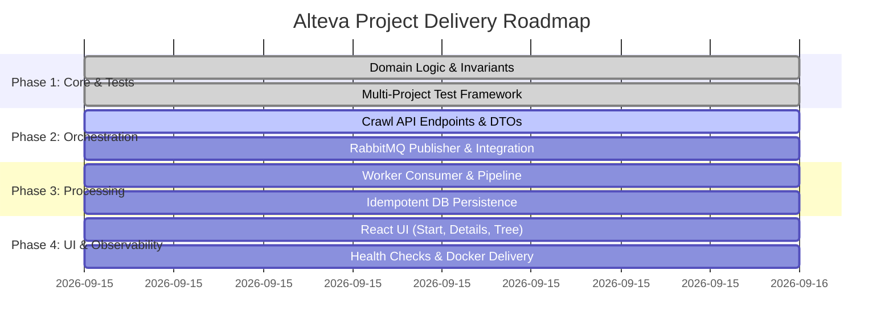

# Alteva Project Milestones

- **Project:** Alteva Web Crawler System
- **Tracking Directory:** `dev_content/`
- **Last Updated:** 2026-09-15

---

## Roadmap Overview

---

## Milestone 1: Domain Core & Multi-Project Test Framework
- **Status:** Complete (100%)
- **Target:** Establish foundational business rules, system contracts, and automated test coverage across all layers.
- **Key Deliverables:**
  - `UrlNormalizer`: RFC 3986 URL normalization, fragment stripping, relative link resolution, scheme filtering (`mailto:`, `tel:`, `javascript:`).
  - `DomainLinkRatioCalculator`: Exact formula implementation with zero-link handling.
  - `JobTreeBuilder`: Cycle-safe directed graph to hierarchical tree conversion.
  - Test suites created in `tests/` across Domain, Infrastructure, CrawlWorker, and CrawlApi (56 .NET tests passing).
  - Frontend Vitest suite configured (9 tests passing).

---

## Milestone 2: Crawl API & Job Orchestration
- **Status:** Complete (100%)
- **Target:** Expose RESTful endpoints for submitting crawl jobs, querying job status, paginating job history, and retrieving page trees.
- **Key Deliverables:**
  - `POST /api/jobs`: Validates input URL and `maxDepth`, persists `Pending` job in DB, publishes event to RabbitMQ.
  - `GET /api/jobs/{id}`: Returns job status, execution timestamps, failure reasons, and hierarchical tree result.
  - `GET /api/jobs`: Returns paginated job history sorted by `CreatedAt` descending.
  - `POST /api/jobs/{id}/cancel`: Cancels pending or running jobs.
  - `/health` endpoint and CORS policy for React frontend.
  - 18 unit/integration tests in `Alteva.CrawlApi.Tests` covering all controller endpoints and validation.

---

## Milestone 3: Event-Driven Worker Pipeline & Idempotent Persistence
- **Status:** Complete (100%) — **superseded by Milestone 6** (the job-level in-memory BFS described here was replaced by a recursive one-page-per-message crawl).
- **Target:** Reliable message consumption, automated retries for transient HTTP/DB failures, dead-letter queue (DLQ) handling, and idempotent writes.
- **Key Deliverables:**
  - RabbitMQ consumer service (`Worker`) with prefetch limit (`BasicQos(0, 1, false)`) and explicit acknowledgments (`ack` / `nack`).
  - Worker lifecycle management: transitions job to `Running`, executes `CrawlerEngine`, transitions to `Completed` or `Failed`.
  - Idempotent upserts / duplicate suppression using composite DB keys and pre-save cleanup per `JobId`.
  - Dead-letter exchange (`dlx`) routing poison messages and retry exhaustion to DLQ.
  - End-to-end verified via Docker Compose with live crawl of `https://example.com/` and recursive tree assembly.
  - 9 automated unit/integration tests in `Alteva.CrawlWorker.Tests` (70 total .NET tests passing across solution).

---

## Milestone 4: Frontend UI (React + Vite)
- **Status:** Complete (100%)
- **Target:** Interactive, responsive single-page application demonstrating the three core user workflows.
- **Key Deliverables:**
  - **Start Crawl Screen**: URL input, optional depth selector, validation, submit action navigating to Job Details.
  - **Job Details Screen**: Live status badge, timestamps, polling progress indicator, interactive recursive tree view with Domain Link Ratio tags.
  - **History Screen**: Paginated table of past crawl jobs with quick navigation.

---

## Milestone 5: Observability, Docker Delivery & Final Documentation
- **Status:** Complete (100%)
- **Target:** End-to-end multi-container orchestration, structured logging, health endpoints, and comprehensive README.
- **Key Deliverables:**
  - Health checks (`/health`) on both API and Worker.
  - Correlation IDs (`jobId`) across logs.
  - Validated `docker-compose.yml` running SQL Server, RabbitMQ, API, and Worker together.
  - Final project README covering run instructions, architecture choices, trade-offs, and future improvements.

---

## Milestone 6: Recursive Page Crawl Refactor (`feat/recursive-page-crawl`)
- **Status:** Complete (100%)
- **Target:** One RabbitMQ message per page, recursively to the requested depth; sequential and polite; robust to redelivery, crashes, cancellation and infrastructure outages.
- **Key Deliverables:**
  - **Phase 1 — Contract & schema:** `CrawlPageMessage`, `PageStatus`, page crawl state, `(JobId, UrlHash)` unique key (SHA-256; avoids the 1700-byte index limit).
  - **Sequential crawling:** removed all semaphores/parallelism; random 3–5 s politeness delay before every download.
  - **Phase 2 — Infrastructure:** `CrawlStateStore` (transactional page commit, claims, completion, cancel), publisher confirms, shared RabbitMQ topology.
  - **Phase 3 — Recursion:** `PageCrawlHandler` + `PageCrawler`; worker acks after commit and confirmed child publishes; cancellation aborts the in-flight page within ~1 s.
  - **Phase 4 — API & UI:** atomic cancel, 503 + `Failed` job when the root cannot be queued, progress counts and progress bar, breadth-first tree (each page once, page status).
  - **Requirement gaps:** HTTP retries for transient failures (408/429/5xx/network/timeout, `Retry-After`); worker `/health` (RabbitMQ consumer + database).
  - **Phase 5 — Failure policy:** infrastructure failures requeue with a 10 s delay instead of dead-lettering; DLQ holds only malformed messages; dropped `Job.RetryCount`.
  - **Phase 6 — Hardening & delivery:** link resolution against the fetched URL, entity decoding, percent-encoding preserved; README per requirements; end-to-end verification on Docker Compose (see `architecture_notes.md` §8).
  - 108 .NET tests and 9 frontend tests passing.
