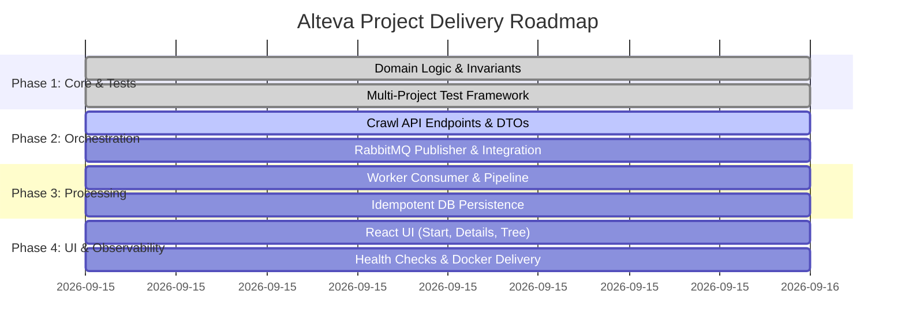

# Alteva Project Milestones

- **Project:** Alteva Web Crawler System
- **Tracking Directory:** `dev_content/`
- **Last Updated:** 2026-09-15

---

## Roadmap Overview

---

## Milestone 1: Domain Core & Multi-Project Test Framework
- **Status:** Complete (100%)
- **Target:** Establish foundational business rules, system contracts, and automated test coverage across all layers.
- **Key Deliverables:**
  - `UrlNormalizer`: RFC 3986 URL normalization, fragment stripping, relative link resolution, scheme filtering (`mailto:`, `tel:`, `javascript:`).
  - `DomainLinkRatioCalculator`: Exact formula implementation with zero-link handling.
  - `JobTreeBuilder`: Cycle-safe directed graph to hierarchical tree conversion.
  - Test suites created in `tests/` across Domain, Infrastructure, CrawlWorker, and CrawlApi (56 .NET tests passing).
  - Frontend Vitest suite configured (9 tests passing).

---

## Milestone 2: Crawl API & Job Orchestration
- **Status:** Complete (100%)
- **Target:** Expose RESTful endpoints for submitting crawl jobs, querying job status, paginating job history, and retrieving page trees.
- **Key Deliverables:**
  - `POST /api/jobs`: Validates input URL and `maxDepth`, persists `Pending` job in DB, publishes event to RabbitMQ.
  - `GET /api/jobs/{id}`: Returns job status, execution timestamps, failure reasons, and hierarchical tree result.
  - `GET /api/jobs`: Returns paginated job history sorted by `CreatedAt` descending.
  - `POST /api/jobs/{id}/cancel`: Cancels pending or running jobs.
  - `/health` endpoint and CORS policy for React frontend.
  - 18 unit/integration tests in `Alteva.CrawlApi.Tests` covering all controller endpoints and validation.

---

## Milestone 3: Event-Driven Worker Pipeline & Idempotent Persistence
- **Status:** Active (In Progress)
- **Target:** Reliable message consumption, automated retries for transient HTTP/DB failures, dead-letter queue (DLQ) handling, and idempotent writes.
- **Key Deliverables:**
  - RabbitMQ consumer binding with explicit acknowledgments (`ack` / `nack`).
  - Worker lifecycle management: transition job to `Running`, execute `CrawlerEngine`, transition to `Completed` or `Failed`.
  - Idempotent upserts / duplicate suppression using composite DB keys `(JobId, Url)` and `(JobId, ParentUrl, ChildUrl)`.
  - Dead-letter exchange (`dlx`) routing poison messages after retry exhaustion.

---

## Milestone 4: Frontend UI (React + Vite)
- **Status:** Planned
- **Target:** Interactive, responsive single-page application demonstrating the three core user workflows.
- **Key Deliverables:**
  - **Start Crawl Screen**: URL input, optional depth selector, validation, submit action navigating to Job Details.
  - **Job Details Screen**: Live status badge, timestamps, polling progress indicator, interactive recursive tree view with Domain Link Ratio tags.
  - **History Screen**: Paginated table of past crawl jobs with quick navigation.

---

## Milestone 5: Observability, Docker Delivery & Final Documentation
- **Status:** Planned
- **Target:** End-to-end multi-container orchestration, structured logging, health endpoints, and comprehensive README.
- **Key Deliverables:**
  - Health checks (`/health`) on both API and Worker.
  - Correlation IDs (`jobId`) across logs.
  - Validated `docker-compose.yml` running SQL Server, RabbitMQ, API, and Worker together.
  - Final project README covering run instructions, architecture choices, trade-offs, and future improvements.
